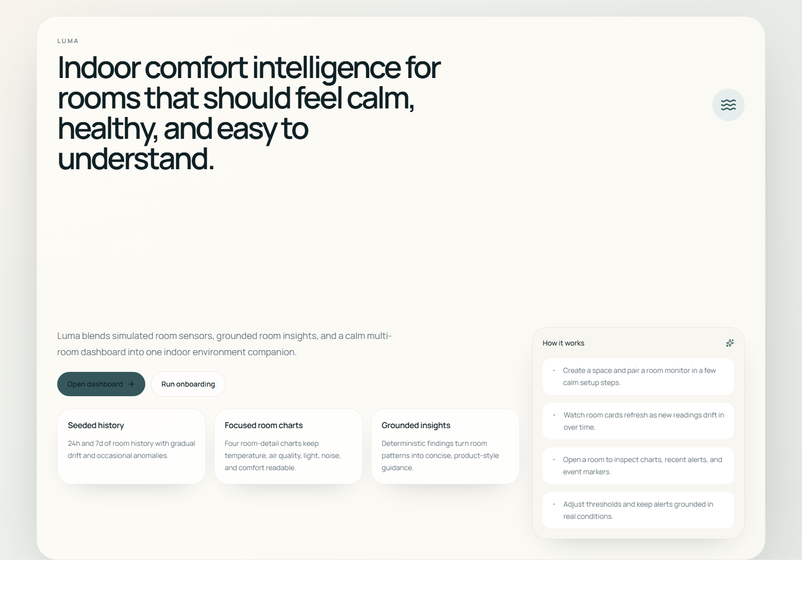
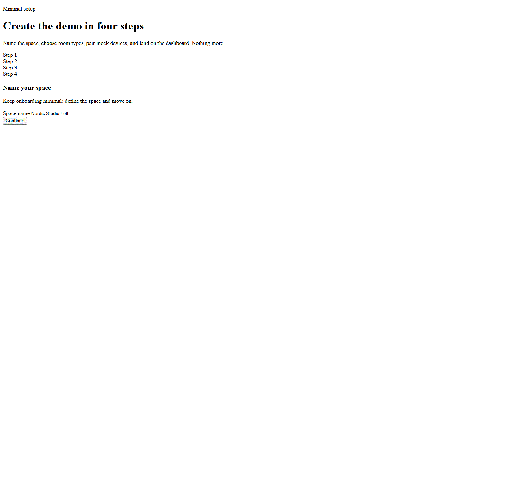
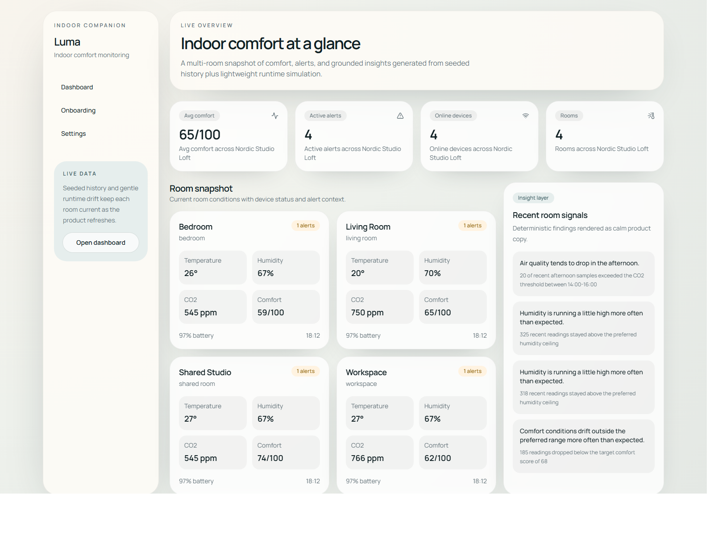
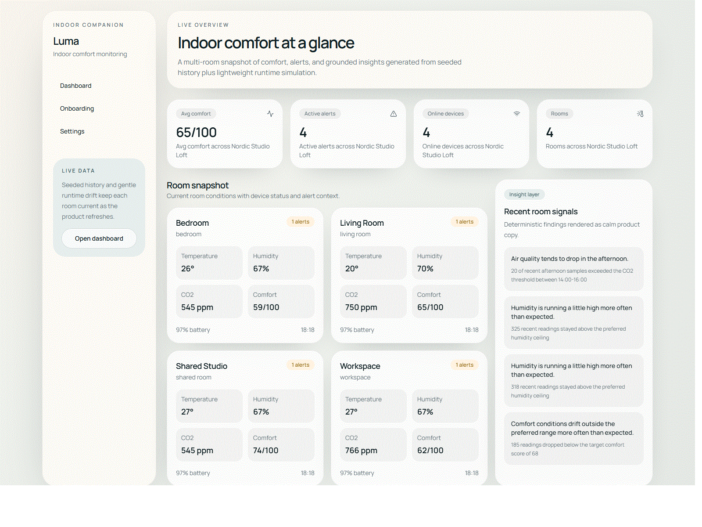
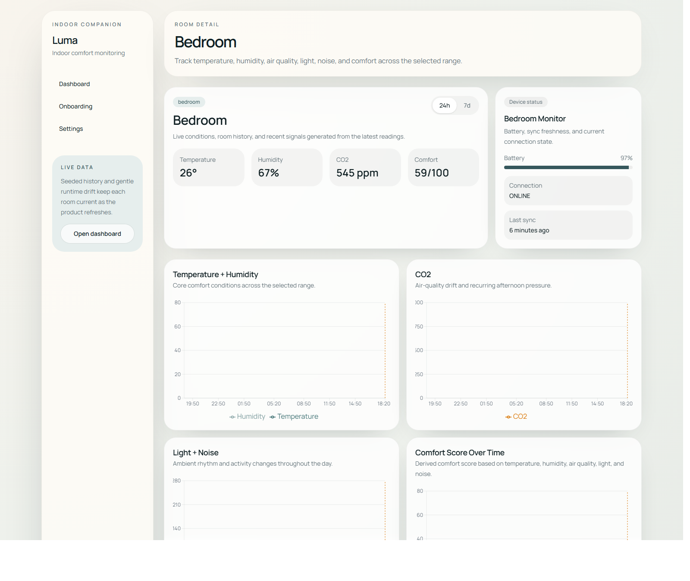
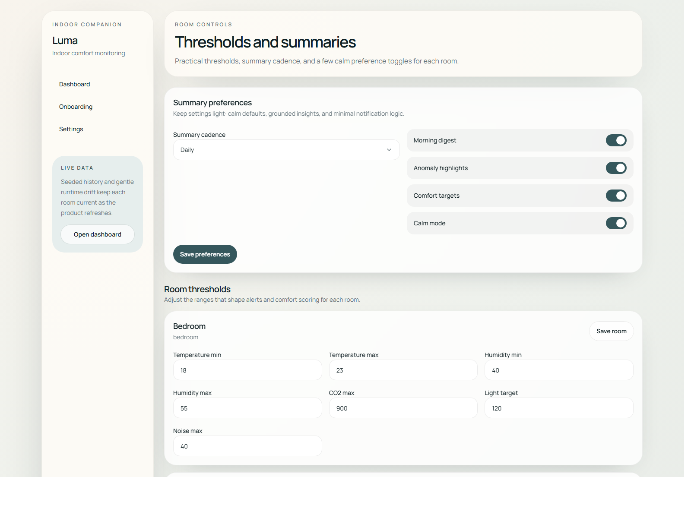

# Luma

Luma is a smart indoor environment companion built to help people understand comfort, air quality, light, and noise across the rooms they use every day. It combines simulated room sensors, a calm multi-room dashboard, grounded alerts, derived comfort scoring, and a lightweight insight layer into a clean full-stack product experience.

## Product Overview

Luma is designed around a simple idea: indoor comfort should feel understandable instead of technical. Rather than exposing raw device telemetry without context, the product turns room data into a readable overview, a focused room detail experience, and a small set of signals that explain when something needs attention.

The current version stays intentionally narrow. It supports one primary space, one paired device per room, a four-step onboarding flow, a continuously refreshing dashboard, a fixed room-detail visualization set, and practical settings. That scope keeps the experience coherent while still allowing the product to demonstrate real state, real data flow, and real decision-making.

## Visual Overview

### Landing Experience



The landing page introduces the product clearly and gives two direct entry points: open the dashboard immediately or walk through the guided setup flow.

### Guided Setup



The onboarding flow stays intentionally short. It names the space, selects room types, pairs room monitors, and then hands off to the dashboard without adding unnecessary configuration.

### Live Dashboard





The dashboard shows room conditions, device health, active alerts, and recent insights. Lightweight polling keeps the interface moving without introducing real-time infrastructure complexity.

### Room and Settings Views





The room detail page focuses on one environment with fixed chart scope, recent signals, and alert context. The settings page keeps controls practical by focusing on thresholds and summary preferences.

## What the Product Does

The product flow starts on a focused landing page and quickly moves into a usable environment view.

- The user can open the dashboard immediately from the landing page.
- A short onboarding flow creates a space, selects room types, pairs room monitors, and seeds realistic room history.
- The dashboard provides a live multi-room snapshot of current conditions, device state, alerts, and recent insights.
- A room detail page drills into one room with fixed visualizations, event markers, alerts, and presentation-ready insight summaries.
- The settings page allows threshold tuning and preference changes without turning into a full admin console.

What makes the product useful is that each screen is connected to the same underlying system behavior. Readings drive scoring, scoring supports insight generation, thresholds produce alerts, and updates flow back into the UI through a consistent service layer.

## Core Features

### Dashboard

The dashboard acts as the main operational view. It shows room cards, aggregated comfort context, device state, and a concise insight rail. It is designed to answer the question, "Which rooms feel good right now, and which ones need attention?"

### Room Detail

The room detail page intentionally limits itself to four charts:

- Temperature + Humidity
- CO2
- Light + Noise
- Comfort Score Over Time

That fixed scope keeps the page readable and prevents the product from turning into a generic analytics surface. Event markers add narrative context by highlighting anomalies, alerts, and pattern-related moments alongside the charts.

### Onboarding

Onboarding defines the space, selects room types, pairs monitors, and gets the user into the product quickly. It exists to create just enough setup context to make the rest of the app feel personalized, without making setup itself the product.

### Settings

Settings focus on the practical controls that shape the product experience:

- summary cadence
- calm-mode style preferences
- room thresholds for temperature, humidity, CO2, light, and noise

The page is intentionally compact so adjustments feel useful instead of administrative.

### Alerts and Insights

Alerts call out threshold breaches tied directly to sensor values. Insights summarize patterns in a more product-facing way, turning room behavior into readable observations rather than leaving the user with only raw charts.

## Tech Stack

The stack is chosen for clarity and maintainability.

- `Next.js App Router` handles both the product UI and the route-handler API layer.
- `TypeScript` keeps contracts explicit between UI, services, queries, and route handlers.
- `Tailwind CSS` supports the visual system without creating a separate styling abstraction layer.
- `shadcn-style UI primitives` under `src/components/ui` provide a lightweight component base while allowing the interface to keep its own identity.
- `Recharts` powers the room-detail visualizations without overwhelming the product with charting complexity.
- `Zod` validates write payloads and query input at the API edge.
- `Prisma` remains in the repo as the database-oriented evolution path, even though the current runtime uses an in-memory store.
- `date-fns`, `lucide-react`, and a few focused utilities support formatting, timing, and presentation polish.

## Architecture Overview

The architecture is split so each layer has a clear responsibility.

- `src/app/api` handles HTTP transport, validation, and response formatting.
- `src/server/services` contains orchestration and business logic such as simulation refresh, alerts, settings writes, and insight assembly.
- `src/server/queries` provides reusable read operations.
- `src/server/store` owns the current in-memory fake runtime state and mutation helpers.
- `src/lib` contains pure utilities, shared domain types, formatting helpers, constants, scoring logic, and validation schemas.

UI components never talk to storage directly. Route handlers call services, services call queries and utilities, and the data source remains behind those boundaries.

## Data Model

The data model is small, but each entity has a clear product purpose.

- `User` represents the owner of the environment and anchors preference data.
- `Space` is the top-level environment being monitored.
- `Room` defines room identity, room type, and thresholds.
- `Device` represents the paired monitor attached to a room.
- `SensorReading` forms the time-series foundation used across charts, alerts, and insights.
- `Alert` represents a threshold breach or issue that should be surfaced in the product.
- `Insight` stores a product-facing explanation of a meaningful pattern.
- `UserPreference` contains summary cadence and dashboard-related preference state.

## Simulation Strategy

The simulation model is designed to make the product feel grounded without depending on background workers, hardware integrations, or complex infrastructure.

The runtime works in two stages:

1. Seed historical data

Each room starts with a realistic seven-day history. That gives the dashboard, charts, alerts, and insights enough context to feel alive immediately.

2. Generate runtime updates on demand

When the dashboard or room detail page polls for updates, the app generates a fresh reading if enough simulated time has passed. That update introduces gradual drift, room-type-specific behavior, occasional anomalies, and device-state changes such as battery and sync freshness.

This keeps the product responsive while still grounding the experience in state that changes over time.

## Alerts and Comfort Scoring

Alerts are evaluated from the latest readings against room thresholds for metrics like CO2, humidity, and noise. They are intentionally tied to actual readings so the product can explain why an alert exists instead of surfacing abstract warnings.

Comfort scoring is derived rather than stored as a raw measurement. It is a product-level interpretation built from the current readings and room thresholds. That keeps the score explainable and makes it easy to recalculate whenever the product logic changes.

## Insight System

The insight system is intentionally split into two layers.

The first layer is the finding layer. This deterministic step analyzes stored readings and identifies patterns that matter to the product, such as recurring CO2 spikes, abnormal humidity behavior, comfort degradation, or unusual noise conditions.

The second layer is the presentation layer. It takes those findings and turns them into concise user-facing product copy. The current phrasing is deterministic, but the architecture leaves room for an optional LLM adapter later without making the product dependent on it.

Example:

- finding: `co2_high_recurring_afternoon`
- evidence: `5 of recent afternoon samples exceeded the CO2 threshold between 14:00-16:00`
- display text: `Air quality tends to drop in the afternoon.`

That split keeps the product grounded in evidence while still allowing the interface to speak in a calm, readable way.

## Running the Project Locally

The current local workflow does not require PostgreSQL.

1. Install dependencies

```bash
npm install
```

2. Start the development server

```bash
npm run dev
```

3. Open the app in the browser

```text
http://localhost:3000
```

4. Explore the main product flows

- start from the landing page
- open the dashboard or run onboarding
- open the dashboard and room detail pages
- update thresholds and preferences in settings

Important behavior to know:

- the fake in-memory store is seeded automatically at server startup
- onboarding and settings mutate that in-memory state during the current session
- restarting the server resets the app back to the seeded baseline
- `.env`, Prisma migrations, and `db:seed` are not required for the current fake-data workflow

For a more stable local runtime after building the app:

```bash
npm run build
npm run start
```

## Scripts

- `npm run dev`
  Starts the Next.js development server for everyday local iteration.
- `npm run build`
  Builds the production bundle and verifies the app can ship cleanly.
- `npm run start`
  Runs the built production app locally.
- `npm run lint`
  Runs ESLint across the project.
- `npm run db:generate`
  Generates the Prisma client for future database-backed work.
- `npm run db:migrate`
  Remains available for a future PostgreSQL-backed version.
- `npm run db:seed`
  Remains available for future Prisma/PostgreSQL reactivation.

## Design Decisions

Luma is designed to feel calm, premium, and readable rather than dense or administrative. The interface leans on soft surfaces, warmer neutrals, clear spacing, and a restrained visual system so the product feels like a thoughtful indoor companion instead of an internal ops dashboard.

A few decisions shape that tone:

- a restrained color system with warmer neutrals
- rounded, spacious layouts instead of compact enterprise density
- fixed chart scope so room detail stays focused
- clear loading, empty, and error states
- mobile-aware layouts that still read clearly on narrower screens

## Tradeoffs and Simplifications

Several simplifications are intentional.

- the current runtime uses an in-memory store so the app is easy to run locally
- polling is used instead of WebSockets to keep updates readable without adding real-time infrastructure
- the product supports one primary space and one device per room in the current version
- the current insight layer is deterministic instead of depending on AI services
- production authentication, collaboration, notifications, and exports are intentionally excluded

These are scope decisions, not hidden gaps in the product model.

## Future Improvements

The next natural extensions of the current architecture are:

- reactivate PostgreSQL with Prisma as the live runtime store
- add an optional LLM phrasing adapter on top of the deterministic insight system
- expand historical summaries and comfort comparisons
- improve device realism without turning the product into a firmware simulator
- add richer visual assets and release-ready polish
- introduce a lightweight authentication path once single-user mode is no longer enough
